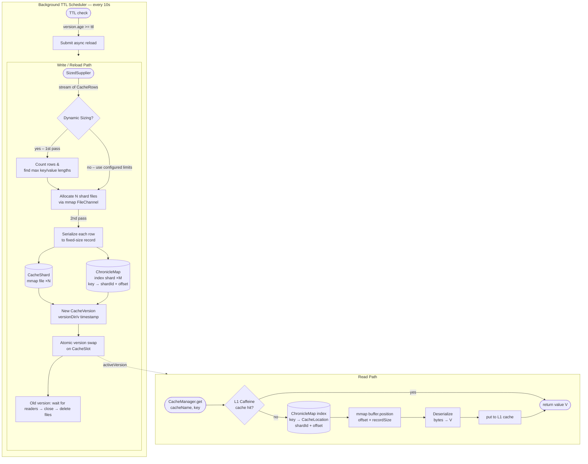

# High Performance Memory-Mapped Cache

A compact, production-ready Java caching library designed to store and serve very large key-value datasets with minimal
heap pressure. Data is written as fixed-size binary records to memory-mapped shard files (mmap) while an optional
in-heap Caffeine layer serves hot keys. An off-heap ChronicleMap index resolves keys to physical file positions in O(1).

---

## How it works — architecture overview



---

## Layer-by-layer explanation

### 1 · CacheManager — the singleton coordinator

`CacheManager` is a global singleton initialized once via `CacheManager.initialize(builder)`. It owns:

- A `ConcurrentHashMap<String, CacheSlot>` — one slot per registered cache name.
- A background `TTL_SCHEDULER` that polls every 10 seconds whether any active version has exceeded its configured TTL and triggers an async reload if so.
- A `RELOAD_EXECUTOR` thread pool that performs background reloads and old-version cleanup without blocking readers.

A `CacheSlot` is the stable, named handle for one cache. It holds a `volatile CacheVersion activeVersion` so reads always see the latest fully-built version without taking any lock.

---

### 2 · CacheVersion — immutable snapshot

Every reload produces a brand-new `CacheVersion` object. It is completely immutable once built: shard files, the ChronicleMap index, and the Caffeine cache are all fixed at construction time. When a new version is ready it atomically replaces the old one via a `synchronized` swap on the slot. The old version is then closed and its files deleted — but only after a spin-wait confirms no thread still holds a reader reference (tracked via an `AtomicInteger` reader counter with `acquireReader` / `releaseReader`).

Each version lives in its own timestamped subdirectory on disk:

```
basePath/
  myCache/
    v1774467341876/          ← active version directory
      shard_0000.bin
      shard_0001.bin
      ...
      index_0000.chm
      index_0001.chm
      ...
    v1774467338000/          ← previous version (being cleaned up asynchronously)
```

---

### 3 · How the mmap shard files are created

When `doReload()` runs, it executes the following pipeline:

**Step 1 — row counting / dynamic sizing**

If `dynamicSizing = true` is set on the `CacheDefinition`, the supplier is consumed once (a full stream pass) only to determine:
- the total row count `N`
- the longest key in bytes (`maxKeyBytes`)
- the longest serialized value in bytes (`maxValueBytes`)

This allows record sizes to be tightly fitted to the actual data instead of wasting disk space with over-provisioned static defaults. If the supplier provides a known count upfront via `SizedSupplier.of(supplier, count)`, the count pass is skipped entirely, reducing load time by ~50%.

**Step 2 — shard file allocation**

From the row count and `shardCapacity` (records per shard file), the number of shards is determined:

```
shardCount = ceil(N / shardCapacity)
```

For each shard, `CacheShard` opens a `FileChannel` with `READ + WRITE + CREATE + TRUNCATE_EXISTING` and immediately calls `channel.map(READ_WRITE, 0, fileSize)` to obtain a `MappedByteBuffer`. The OS backs this buffer with the shard file on disk; no explicit `read()` / `write()` system calls are needed for individual records — writes go directly to the mapped memory pages and are durably flushed via `buffer.force()` after all records are written.

```
shardFileSize = recordSize × shardCapacity
recordSize    = 8 + 2 + maxKeyBytes + 2 + maxValueBytes + 8
               (id)  (kLen)            (vLen)             (ts)
               └────────── 20 bytes fixed overhead ───────────┘
```

**Step 3 — writing records**

The supplier is consumed a second time (or first time if count was known). For each `CacheRow`, a reusable `CacheEntry` is populated and `serialize(buffer)` positions the mmap buffer to `offset × recordSize` in the correct shard, then writes one contiguous binary block:

```
┌──────────┬─────────┬──────────────────┬──────────┬──────────────────┬───────────┐
│  id (8B) │kLen (2B)│  key (maxKeyBytes)│vLen (2B) │ value (maxValueB) │  ts (8B) │
└──────────┴─────────┴──────────────────┴──────────┴──────────────────┴───────────┘
```

Unused key/value bytes are zero-padded so every record is exactly `recordSize` bytes wide. This fixed stride is what enables O(1) random access: `position = offset × recordSize` with no scanning.

**Step 4 — ChronicleMap index**

As each record is written, its physical location is registered in a sharded ChronicleMap index:

```
key  →  CacheLocation { shardId, offset }
```

The key is routed to one of `M` index shards deterministically:

```
indexShardId = (key.hashCode() & 0x7fffffff) % indexShardCount
```

ChronicleMap persists the index off-heap in `.chm` files so the JVM heap stays clean even with tens of millions of keys. On Windows, where a single mmap file is limited to ~4 GB, the index is automatically partitioned across multiple `.chm` files (`indexShardCount` controls how many; default 16).

---

### 4 · Read path — from key to value in four steps

```
CacheManager.get("products", "product_42")
       │
       ├─► CacheSlot → activeVersion              (volatile read, no lock, no allocation)
       │
       ├─► version.getFromMemory("product_42")    (Caffeine L1, ~50–100 ns if warm)
       │       hit  → return Product
       │
       ├─► indexShards[hash % M].get("product_42") (ChronicleMap off-heap)
       │       → CacheLocation { shardId=2, offset=7341 }
       │
       ├─► shards[2].read(7341)
       │       buffer.position(7341 × recordSize)
       │       slice(recordSize) → deserialize bytes   (OS page-cache, no syscall if warm)
       │
       ├─► definition.deserializer.apply(bytes)    (user-supplied, e.g. Jackson)
       │       → Product
       │
       └─► version.putToMemory("product_42", product)  (promote to L1)
               → return Product
```

The read never loads the full shard into memory. The OS page cache serves the relevant 4K page on the first access; subsequent accesses to nearby records or the same record are served from RAM with no I/O.

---

### 5 · L1 Caffeine cache — when and why

The L1 cache is a `Cache<String, V>` built by Caffeine and lives on the Java heap. It is entirely optional — set `memoryCacheMaxSize(0)` to disable it and route every read through the mmap shards.

When enabled, after every successful mmap read the deserialized `V` object is placed in the L1 cache. Subsequent reads for the same key return the already-deserialized object immediately without touching the index or shard files. This eliminates both the ChronicleMap lookup and the deserialization step entirely.

Eviction is configurable per cache definition:

| Option                | Meaning                                               |
|-----------------------|-------------------------------------------------------|
| `memoryCacheMaxSize`  | Max number of entries; LRU eviction when full         |
| `memoryCacheTtl`      | Expire-after-write: remove entry N seconds after put  |
| `memoryCacheIdleTtl`  | Expire-after-access: remove entry after N idle seconds|

When the underlying `CacheVersion` is swapped out on reload, its Caffeine cache is fully invalidated (`invalidateAll()`) so stale deserialized objects can never be served.

---

## Quick usage

### Initialize CacheManager

```java
Path base = Path.of("/var/lib/mycache");

CacheManager.initialize(
    CacheManager.builder(base)
        .shardCapacity(200_000)         // records per shard file
        .memoryCacheSize(10_000)        // manager-wide L1 default
        .defaultMaxValueBytes(4_096)    // static sizing fallback
        .indexShardCount(16)            // ChronicleMap index partitions
);
```

### Define and register a cache

```java
CacheDefinition<Product> products = CacheDefinition.<Product>builder()
    .name("products")
    // count hint provided → counting pass is skipped on reload
    .supplier(SizedSupplier.of(myDbQuery::stream, 1_000_000))
    .keyExtractor(CacheRow::getKey)
    .serializer(row -> mapper.writeValueAsBytes(row.getValue()))
    .deserializer(bytes -> mapper.readValue(bytes, Product.class))
    .ttl(Duration.ofHours(1))           // background refresh interval
    .memoryCacheMaxSize(10_000)         // 10K hot entries in L1
    .dynamicSizing(true)                // fit record size to actual data
    .build();

CacheManager.register(products);                     // first load (synchronous)
CacheManager.reload("products");                     // manual reload
Product p = CacheManager.get("products", "product_42");
```

---

## Disk layout & sizing

```
recordSize    = 8 + 2 + maxKeyBytes + 2 + maxValueBytes + 8   (20 bytes fixed overhead)
shardFileSize = recordSize × shardCapacity
totalDisk     ≈ recordSize × totalRowCount
```

| Scenario                                     | recordSize | 1M rows  |
|----------------------------------------------|------------|----------|
| dynamicSizing, short keys/values (synthetic)  | ~50 B      | ~48 MB   |
| dynamicSizing, JSON product (~164 B values)   | ~186 B     | ~177 MB  |
| static maxValueBytes=4096                     | ~4116 B    | ~3.9 GB  |

> Always enable `dynamicSizing` or carefully tune `maxKeyBytes` / `maxValueBytes` to your actual data distribution to avoid over-allocating disk and mmap address space.

---

## Performance Benchmarks

### Test machines

| | Machine A | Machine B |
|---|---|---|
| **Used for** | `CachePerformanceTest` | `ProductCatalogBenchmark` |
| **CPU cores** | 16 | 8 |
| **Physical RAM** | 15.73 GB | 15.75 GB |
| **OS** | Windows 10 (10.0 amd64) | Windows 10 (10.0 amd64) |
| **JVM** | OpenJDK 64-Bit Server VM | OpenJDK 64-Bit Server VM |
| **JVM vendor** | Amazon.com Inc. (Corretto) | Oracle Corporation |
| **Java version** | 25.0.1+8-LTS | 25+36-3489 |
| **JVM max heap** | 16 GB | 16 GB |

> Both machines run Windows 10 on NVMe storage.

---

### 1 · Scalability — `CachePerformanceTest` (Machine A)

Single-threaded writes, then 100K uniformly random reads per dataset size.
Free physical memory at test time: **5.52 GB**. Process CPU load: ~5–14%.

| Records  | Shards | Write throughput  | Write time  | Disk      | Heap  | Read avg  | p50      | p95       | p99        | p99.9      | max           |
|----------|--------|-------------------|-------------|-----------|-------|-----------|----------|-----------|------------|------------|---------------|
| 1 K      | 1      | 745 / s           | 1,343 ms    | 1 MB      | 8 MB  | 4.06 µs   | 2.90 µs  | 6.72 µs   | 20.80 µs   | 92.78 µs   | 168.60 µs     |
| 10 K     | 1      | 117,647 / s       | 85 ms       | 2 MB      | 0 MB  | 2.14 µs   | 1.90 µs  | 2.70 µs   | 10.30 µs   | 21.40 µs   | 91.60 µs      |
| 100 K    | 1      | 813,008 / s       | 123 ms      | 16 MB     | 0 MB  | 1.00 µs   | 0.90 µs  | 1.50 µs   | 2.10 µs    | 14.90 µs   | 45.20 µs      |
| 1 M      | 10     | 1,270,648 / s     | 787 ms      | 154 MB    | 0 MB  | 1.35 µs   | 1.10 µs  | 2.20 µs   | 2.80 µs    | 17.80 µs   | 51.70 µs      |
| 5 M      | 50     | 1,346,620 / s     | 3,713 ms    | 771 MB    | 0 MB  | 1.73 µs   | 1.80 µs  | 2.60 µs   | 3.10 µs    | 18.00 µs   | 95.20 µs      |
| 10 M     | 100    | 1,133,787 / s     | 8,820 ms    | 1,541 MB  | 0 MB  | 2.41 µs   | 2.40 µs  | 3.30 µs   | 5.20 µs    | 19.50 µs   | 1,513.80 µs   |
| 50 M     | 500    | 621,512 / s       | 80,449 ms   | 8,007 MB  | 0 MB  | 10.33 µs  | 3.20 µs  | 9.40 µs   | 170.40 µs  | 236.10 µs  | 8,131.30 µs   |
| 100 M    | 1,000  | 414,893 / s       | 241,026 ms  | 16,014 MB | 1 MB  | 69.72 µs  | 7.40 µs  | 195.60 µs | 295.20 µs  | 536.70 µs  | 16,662.90 µs  |

**Observations:**

- **Heap stays at 0 MB** for all datasets above 10K records. The ChronicleMap index and all shard data live off-heap; the JVM heap is not involved in storage at all.
- **GC pauses during reads are zero** across every dataset size — including 100M records. Reads touch only mmap buffers and off-heap ChronicleMap memory, leaving the GC nothing to collect.
- **Read latency is stable between 1–2.5 µs avg** for 1K–10M entries, confirming the O(1) seek guarantee of fixed-size records. Looking up any of 10 million records takes roughly the same wall time as looking up 1 of 1 thousand.
- **Write throughput peaks at ~1.3M records/sec** in the 1M–5M range. At 50M+ entries, creating and mapping hundreds of shard files becomes the bottleneck rather than serialization.
- **At 50M+ entries, p99 latency rises sharply** (170+ µs). With ~5.5 GB RAM free at runtime, the 8 GB working set of the 50M shard files begins to exceed available OS page cache, causing page faults on random access. This is a physical-memory constraint, not a code-level bottleneck.
- The **max latency spike at 10M** (1,513 µs) is a single cold-shard page-fault outlier and does not reflect steady-state behaviour.

---

### 2 · Concurrent throughput — `ProductCatalogBenchmark` (Machine B)

**Setup:** 1 million products serialized as JSON, each approximately 164 bytes. 8 concurrent reader threads, uniformly
random key access, 10-second sustained benchmark. Measures end-to-end throughput including ChronicleMap lookup, mmap
read, and full Jackson deserialization. 5 data shards created with `dynamicSizing=true`
(`maxKeyBytes=18`, `maxValueBytes=164`).

```
Product {
    String id;           // "product_0" … "product_999999"
    String name;
    String category;     // 100 distinct values  (i % 100)
    double price;
    Map<String, String> attributes;   // 1 entry per product
}
```

Two runs were performed back-to-back on the same machine under different system load conditions:

| Config               | Free RAM at runtime | System CPU load | Process CPU load | Load time | Throughput        | Avg latency |
|----------------------|---------------------|-----------------|------------------|-----------|-------------------|-------------|
| L1 disabled (`size=0`) | 4.72 GB           | 40.07%          | 13.63%           | 5.68 s    | **486,400 ops/sec** | 0.016 ms  |
| 10,000-entry LRU     | 2.80 GB             | 59.93%          | 9.77%            | 10.86 s   | **230,566 ops/sec** | 0.034 ms  |

> ⚠️ **Important caveat:** the two runs show the LRU-disabled run outperforming the LRU-enabled run. This is the
> opposite of what would be expected under equal conditions. The key difference is that the 10K-LRU run had
> significantly higher system-wide CPU load (59.93% vs 40.07%) and ~1.9 GB less free RAM (2.80 GB vs 4.72 GB).
> At 1M entries × ~184 bytes/record ≈ 877 MB of shard data, the reduced page-cache availability under memory pressure
> likely caused more OS page faults on random reads, dominating the latency measurement and masking any L1 benefit.
> To isolate the effect of the Caffeine L1 layer cleanly, both runs should be repeated under identical system load
> conditions.

**What the results do confirm regardless of the L1 variable:**

- A single JVM node sustains **230K–486K product lookups/sec** on 8 cores with negligible heap pressure and zero GC during reads.
- Average end-to-end latency (index + mmap read + Jackson deserialization) stays below **0.035 ms** even under elevated system load.
- The mmap layer alone — without any in-memory L1 — is sufficient for demanding production read workloads at this scale.

---

### 3 · Fixed record overhead

| Component          | Size                         |
|--------------------|------------------------------|
| Entry ID           | 8 bytes (long)               |
| Key length field   | 2 bytes (short)              |
| Key data           | maxKeyBytes (variable)       |
| Value length field | 2 bytes (short)              |
| Value data         | maxValueBytes (variable)     |
| Timestamp          | 8 bytes (long)               |
| **Fixed overhead** | **20 bytes per record**      |

At 100K–10M records with dynamic sizing in the synthetic test, effective on-disk usage was ~162–172 bytes/record
(keys ~12–14 bytes, values ~14–17 bytes). In the product benchmark, observed disk usage matched the ~164-byte JSON
payload plus 20 bytes overhead = ~184 bytes/record.

---

## ChronicleMap index sharding

On Windows a single memory-mapped file cannot exceed ~4 GB. For large keysets the ChronicleMap index is automatically
partitioned into `indexShardCount` `.chm` files. Keys are routed deterministically so the same key always resolves to
the same shard:

```
indexShardId = (key.hashCode() & 0x7fffffff) % indexShardCount
```

At 100M entries with the default `indexShardCount=16`, each index shard holds ~6.25M keys. Raise `indexShardCount`
proportionally for datasets above ~50M keys to stay within the OS mmap file size limit.

---

## Examples

See examples in `test/java/tr/kontas/cache/example` folder.

## License

This repository is licensed under GNU GPL v3.0 (see `LICENSE`).
